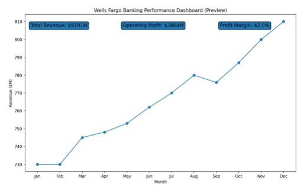

# Wells Fargo Banking Performance Dashboard

## Project Overview

This project demonstrates a Power BI-style financial dashboard analyzing key banking performance indicators using a Wells Fargo case example. The dashboard tracks revenue performance, profitability, and banking balance metrics through KPI-driven visual analytics.

## Tools Used

Power BI-style dashboard design  
Excel Data Modeling  
Financial KPI Analytics  
Business Intelligence Visualization  

## Dataset

The dataset contains simulated monthly banking performance metrics including:

- Net Interest Income
- Non-Interest Revenue
- Operating Expenses
- Loan Balance
- Deposit Balance

These metrics are commonly used in banking analytics to evaluate profitability and liquidity performance.

## Key Measures

The dashboard calculates the following KPIs:

- Total Revenue
- Operating Profit
- Profit Margin
- Loan Growth
- Deposit Growth

These measures help evaluate financial performance and balance sheet trends.

## Dashboard Insights

Key insights from the analysis include:

- Net interest income demonstrates steady growth across the year
- Deposit balances show consistent liquidity expansion
- Operating expenses increase moderately due to operational investment
- Revenue growth drives improved profitability

## Data Governance

### Refresh Process

1. Update dataset  
2. Refresh Power BI model  
3. Validate KPI measures  
4. Republish dashboard  

### Refresh Frequency

Monthly

## Skills Demonstrated

Financial KPI Analysis  
Business Intelligence Dashboard Design  
Data Modeling  
Variance Analysis  
Data Governance  

## Project Structure

